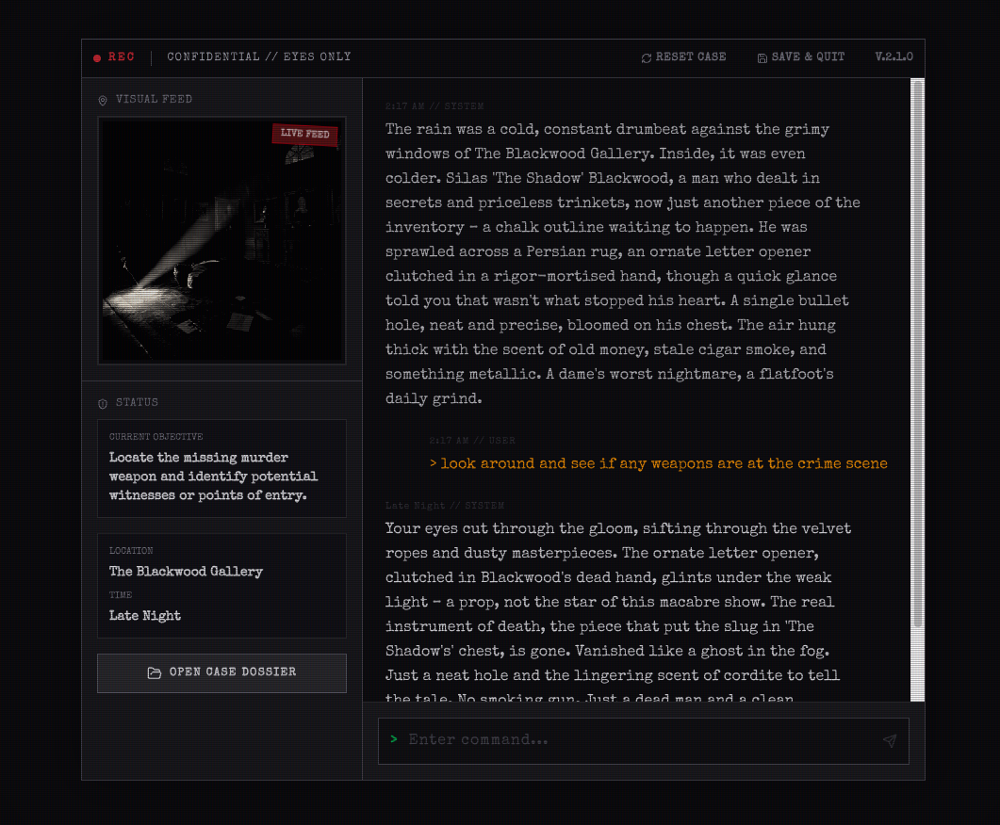
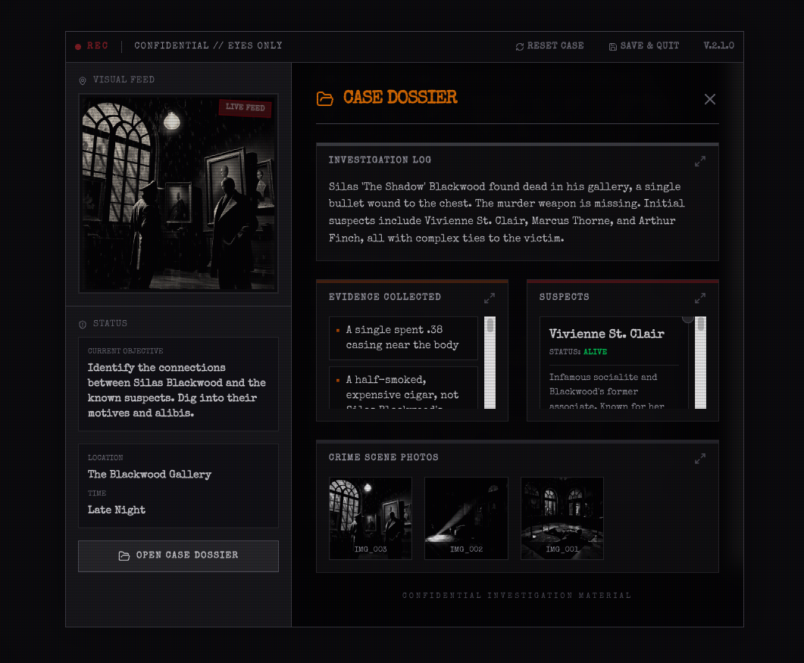

# 🕵️ NOIR - AI-Powered Detective Game

> **A Film Noir murder mystery game powered by AI** - where every case is unique, every clue matters, and every suspect has secrets.

[](https://noir-orcin.vercel.app)
[](https://nextjs.org/)
[](https://vercel.com)

https://noir-orcin.vercel.app
---

## 📚 Course Context

This project was developed as part of the **"Dezvoltare Software Asistată de AI"** (AI-Assisted Software Development) course at **Universitatea Politehnica Timișoara**, Faculty of Automation and Computing.

**Course Objectives:**
- Master AI-powered development tools (GitHub Copilot, ChatGPT, Claude, etc.)
- Learn advanced prompt engineering techniques
- Build real-world applications with AI assistance
- Integrate modern AI APIs into full-stack applications

---

## 🎯 Project Overview

**NOIR** is a text-based, AI-driven murder mystery game that brings the atmospheric tension of Film Noir detective stories to life. Each playthrough is unique, with procedurally generated cases, dynamic suspect behaviors, and AI-powered narrative responses.

### Key Features

- 🎲 **Procedurally Generated Cases** - Every game is unique with randomly generated victims, suspects, locations, and motives
- 🤖 **AI Game Master** - Google's Gemini 2.5 Flash powers the narrative, dynamically responding to player actions
- 🖼️ **Visual Scene Generation** - AI-generated noir-style imagery for each scene using Pollinations.ai
- 👤 **User Authentication** - Secure sign-in/sign-up with Clerk
- 💾 **Case Persistence** - Save and resume cases across sessions with Prisma + PostgreSQL
- 📁 **Case Archive** - View and manage all your past investigations in a dedicated dashboard
- 🎨 **Film Noir Aesthetic** - Dark, atmospheric UI with amber accents, monospace fonts, and CRT-style effects

---

## 🛠️ Tech Stack

### Frontend
- **Next.js 16** (with Turbopack) - React framework with server-side rendering
- **React 19** - Latest React with concurrent features
- **Tailwind CSS 4** - Utility-first CSS framework for styling
- **Lucide React** - Icon library for UI elements
- **Special Elite Font** (Google Fonts) - Typewriter-style font for noir atmosphere

### Backend & AI
- **Google Generative AI** (`gemini-2.5-flash`) - Powers the game master and narrative generation
- **Pollinations.ai** - AI image generation for crime scenes
- **Clerk** - Authentication and user management
- **Prisma ORM** - Type-safe database access
- **PostgreSQL** (Vercel Postgres) - Production database

### Deployment & Tools
- **Vercel** - Hosting and continuous deployment
- **Git/GitHub** - Version control and collaboration
- **TypeScript** - Type safety across the codebase

---

## 🎮 How It Works

### Game Flow

1. **Authentication** - Users sign in via Clerk (email, Google, or Facebook)
2. **Dashboard** - View active and solved cases, or start a new investigation
3. **Case Generation** - The AI generates a unique murder mystery:
   - Random victim, location, and time
   - 3 suspects (one is the killer)
   - Evidence scattered throughout the scene
   - Motive and backstory
4. **Investigation** - Players type commands to:
   - Examine evidence
   - Interview suspects
   - Explore locations
   - Accuse the killer
5. **Dynamic Narrative** - The AI:
   - Responds to player actions in real-time
   - Reveals or hides clues based on player questions
   - Can kill off suspects if the investigation drags on
   - Ends the game when the player solves the case or fails
6. **Case Closure** - Solved cases are marked in the database and archived

### AI Prompt Engineering

The core of the game is a **system prompt** that defines the AI's behavior:

```plaintext
You are the Game Master of a hard-boiled Noir murder mystery.

Rules:
1. Generate unique, random cases
2. Track killer, victim, and location internally
3. Output strictly valid JSON with narrative, visual prompts, evidence, suspects, and game state
4. Use cynical, atmospheric language
5. Allow suspect deaths if investigation stalls
6. End game when player accuses correctly or fails
```

This prompt ensures:
- **Consistency** - AI always responds in valid JSON format
- **Immersion** - Noir-style narration with short, punchy sentences
- **Gameplay Balance** - AI can dynamically adjust difficulty
- **State Management** - Game state is tracked and updated on every turn

---
## 📸 Screenshots



---
## 🚀 Running Locally

### Prerequisites

- Node.js 18+ and npm
- PostgreSQL database (or use Vercel Postgres)
- API Keys:
  - Google Gemini API key
  - Clerk publishable and secret keys

### Setup

1. **Clone the repository:**
   ```bash
   git clone https://github.com/lukettoOoO/Noir.git
   cd Noir
   ```

2. **Install dependencies:**
   ```bash
   npm install
   ```

3. **Set up environment variables:**
   Create a `.env.local` file:
   ```env
   GEMINI_API_KEY=your_gemini_api_key
   NEXT_PUBLIC_CLERK_PUBLISHABLE_KEY=your_clerk_publishable_key
   CLERK_SECRET_KEY=your_clerk_secret_key
   NEXT_PUBLIC_CLERK_AFTER_SIGN_IN_URL=/
   NEXT_PUBLIC_CLERK_AFTER_SIGN_UP_URL=/game
   PRISMA_DATABASE_URL=your_postgresql_connection_string
   ```

4. **Set up the database:**
   ```bash
   npx prisma db push
   ```

5. **Run the development server:**
   ```bash
   npm run dev
   ```

6. **Open the app:**
   Navigate to [http://localhost:3000](http://localhost:3000)

---

## 📖 What I Learned

### AI-Assisted Development
- **GitHub Copilot Integration** - Used AI autocomplete for ~40% faster coding
- **Prompt Engineering** - Crafted system prompts to control AI behavior precisely
- **AI Debugging** - Leveraged AI to identify and fix bugs (e.g., Prisma schema issues, Clerk configuration)
- **Iterative Refinement** - Learned to refine prompts based on AI output quality

### Problem-Solving
- **Researching Documentation** - Read Next.js, Clerk, and Prisma docs to solve issues
- **Debugging Production Issues** - Fixed environment variable mismatches in Vercel
- **API Integration** - Connected multiple third-party services (Gemini, Pollinations, Clerk)

**AI-Assisted Coding** Used AI to generate boilerplate, debug code, and suggest optimizations 
**Prompt Engineering** Crafted a multi-layered system prompt for consistent game master behavior
**AI API Integration** Integrated Google Gemini for narrative generation and Pollinations for images
**Modern Tools** Leveraged Next.js, Prisma, Clerk, and Vercel for rapid development
**Workflow Automation** Set up automated deployments from GitHub to Vercel
**AI Ethics** Ensured safe, appropriate content generation (no offensive material)

## 📜 License

This project is licensed under the MIT License.

---

## 📧 Contact

**Luca** - Student at UPT  
**GitHub:** [@lukettoOoO](https://github.com/lukettoOoO)  
**Project Link:** [https://noir-orcin.vercel.app](https://noir-orcin.vercel.app)

---

**Course Website:** [Dezvoltare Software Asistată de AI](https://dezvoltaresoftwareai.replit.app/)
